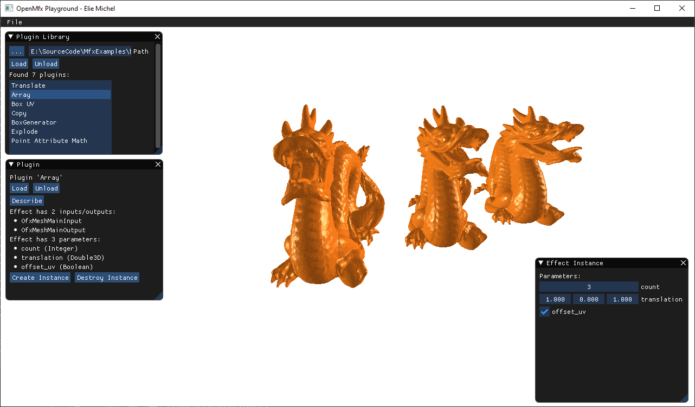

Python Mfx
==========

This is a Python implementation of an [OpenMfx](https://openmesheffect.org) host, which is able to load 3D mesh processing effects from dynamic plugins. Its main purpose is to automate compliance tests when developping OpenMfx plugins, but it can also be used to run these plugins in Python applications.

The whole module is contained in `openmfx.py`:

```python
from openmfx import OfxHost, OfxPluginLibrary, OfxMeshEffectInternal, OfxMeshEffect
from openmfx import constants as kOfx

# Create the global host object
host = OfxHost()

# Dynamically load a mesh effect plugin library
lib = OfxPluginLibrary("some-plugin.ofx")

# A plugin library contains multiple mesh effects
n = lib.OfxGetNumberOfPlugins()
print(f"Found {n} plugins")

# Get a plugin
plugin = lib.OfxGetPlugin(0)
print(
    f"Plugin #0 is called '{plugin.pluginIdentifier.decode()}' " +
    f"version {plugin.pluginVersionMajor}.{plugin.pluginVersionMinor}"
)

# Load plugin
plugin.setHost(host)
status = plugin.mainEntry(kOfx.ActionLoad, None, None, None)
assert(status == kOfx.StatOK)

# ... See example.py for more details
```

Examples
--------

A simple example is given in [`example.py`](example.py), using the [MfxExamples](https://github.com/eliemichel/MfxExamples) plugin. A more advanced one is provided in [`viewer`](viewer/):

[](viewer/)

Known Issues
------------

One may encounter `NotImplemented` errors when calling some of the suite functions. To fix this, locate the mock function call `foo` that resulted in this and add an implementation of `_foo` in the appropriate `OfxSuite` derived class.

License
-------

*The Apache-2.0 License, Copyright (c) 2020-2022 -- Élie Michel <elie.michel@exppad.com>*
